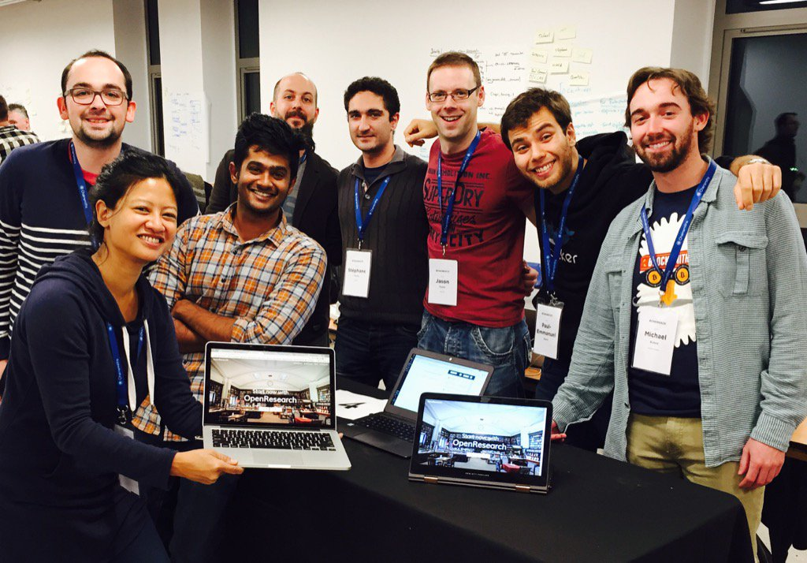
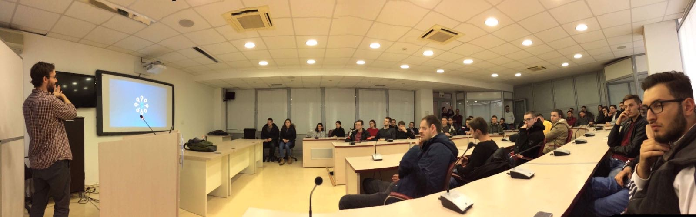

## Fake It Until You Make It

The best career advice I ever received was from my friend [Jon](https://jonbarnes.me). While off the bat sounding cliche, it opened the door for my career in tech. His advice, "Fake it until you make it". The more general point was no one knows what they're doing; we're all just out here LARPing.

Unless your desired career path requires a professional license or academic credential of some sort, I think this advice can apply more broadly to anyone. But first, a primer on the LARP.

## What Is LARPing?

It is an acronym for live action role playing. To paint a picture, you may have witnessed people in a public park or school dressed up as wizards, knights, or elves play fighting with wands, swords, and bows and arrows. If not, you may have seen the act performed on a tv show or movie. Stay with me if this still doesn't make sense.

Think about a turn-based board game, requiring dice rolls and a points system; a good example of this is [Dungeons & Dragons](https://en.wikipedia.org/wiki/Dungeons_%26_Dragons). Now extend that into the real world. This is different from a Midieval Times or Civil War re-enactment in that in LARPing, people wait for their turn to attack or defend. This tends to look rather strange to the passer-by witnessing from a distance.

One would think "Why are they standing there? The knight should be attacking that elf!".

This is the awkward point I'm making.

## Career LARPing

In career LARPing, you declare a title or role for yourself, take an awkward stance, and go through the motions as you await your turn. All the while, scrambling to catch up on the lore, read about the field, and learn the jargon the industry uses. In essence, faking it.

When Jon first shared this advice with me, I was a graduate student at the University of Brighton in the UK studying research psychology. I was doing industry research and analysis for his organizational management consultancy, [Flux](https://flux.am), studying digital democracy and its various experiments around the world.

I had realized in that academic year that I no longer wanted to pursue a PhD in psychology, but rather wanted to try my luck at spinning off a new career in the field of tech. The first logical step was LARPing as a UX researcher. I was already engaged in academic research and now industry research through his firm, so it felt like a doable next leap.

## Applied LARP

The first thing I did was change my LinkedIn title from "Academic Researcher" to "UX Researcher". Then I started following people in the field, reading the recommended books, learning about the industry of product design and UX, and joining design communities.

Fast forward some months and I was working with Flux on a digital democracy project partnered with [The New Digital School](https://thenewdigitalschool.com) in Porto, Portugal. Around the same time, I flew to Dublin, Ireland to participate in a Bitcoin hackathon as a UXer. I started thinking to myself, "This might actually be working".

My first real LARP as a UXer happened at that hackathon. I had no clue what I was doing, but I was placed on a team with a group of software engineers who appreciated any and all design help they could get. I worked with our team lead, a PhD student from Paris, to create wireframes and user flows for our app (jargon I learned along the way).

We ended up building a decentralized P2P research application for academic journals, fully functioning and integrated with the blockchain. It was enough to win us an award at the conference and land a bona fide entry on my resume.

  
  

    Chainsmiths Bitcoin hackathon, OpenResearch team
  

  
November 2016, Ireland

## Making It?

A few months later, I was en route to Porto to serve as a Researcher in Residence at The New Digital School, a new alternative to higher education for students looking to start a career in UX design or full-stack web development.

While working on my thesis, I helped students brainstorm business ideas, design products, and develop their applications.

I had already taken a liking to web development at the hackathon and took a crash course on full-stack software engineering during the time leading up to The New Digital School. This became extremely useful during my time at the school, opening doors to new opportunities and giving me the ability to help (and create) in new ways.

Was I starting to make it? It appeared so.

I now had two experiences I could point to, people and businesses I could use as references, and most importantly, a newfound confidence in what I was doing. While Imposter Syndrome never goes away, I finally felt better about my skillset and ability to contribute meaningfully.

## Owning It

The New Digital School, Flux, and other serendipitous connections eventually led to me being accepted as an Entrepreneur in Residence at [SwissContact](https://swisscontact.org) (later spinning off as [Swiss EP](https://swissep.org/)), a non-profit international development branch of the Swiss government; the stated goal being facilitating business development and startup ecosystems in the Balkans.

Through this program, I served as a strategist and consultant to startups in Albania, Kosovo, North Macedonia, and Bulgaria.

I gave lectures on Bitcoin and blockchain technology at universities, led workshops at incubators and accelerators, and advised product teams with design and tech decisions.

  
  

    South East European University, blockchain lecture
  

  

    November 2017, North Macedonia
  

## Translating to the US

What did this look like heading back to the US? The first to years of my LARP in tech happened in Europe. You could throw a rock and hit a boutique web agency or design studio storefront in a European city. That wasn't so much the case coming home.

I ended up spending months studying UX and web development as much as I could at my desk in my room in my parents' house, partly because I needed more education with programming and partly because I had no clue what my qualifications were or how they translated in a job interview.

However, a consultancy in Des Moines, Iowa took a chance on me. Funnily enough, their parent company, [Capgemini](https://www.capgemini.com), was based out of France.

I was hired as a mid-level software engineer and started my US-based tech career in agtech working at [Corteva Agriscience](https://www.corteva.com). I learned Angular on the job and co-led a team of in-house and off-shore developers. That was my foot in the door.

Nearly a decade later, fake it until you make it payed off. Jon's other point had a lot of truth to it too. I think many of us LARPing through this strange world or work, one way or another.

## Looking Back

Upon reflection, I'm grateful for the opportunities I've had, the people I've been able to meet, work with, and become friends with, and the experience and skills I gained along the way. I can't imagine what my life would be like if I were a behavioral health counselor or community college teacher at this point.

Though I have reconsidered pursuing a PhD.

On a more critical note, I regret not being fully prepared or adequate for some of the experiences I had. I was 23 years old and advising projects and teams. I had LARPed my way into tech and was expected to provide help and guidance to people who desired it. I succeeded at times and fell flat on my face at times.

Failure is a great teacher, yet intentionality and care are also required in doing good work. I was young, eager, and selfishly trying to level up.

There are definitely things I would do differently if I could go back. But I can't, so the best that I can do now is give back after years of experience, some maturity, and more fully-developed skills.

## The Point

Do not be afraid to begin a LARPing journey if you are looking to pivot or learn new skills in your career. It is never too late to learn something new.

LARPing can help convince a potential employeer to take a chance on you; a chance you might not have otherwise had if you still presented yourself as doing the thing you're trying to leave.

Unfortunately, I do think it is harder to get a start in tech in current times. I've watched the market change and job opportunities marketed to junior level talent dry up. It is not uncommon to only see senior level postings anymore. That said, don't let it stop you from applying or reaching out.

There are still employers and potential business partners out there willing to take a chance on you. Often, these are people who remember those who took a chance on them.
